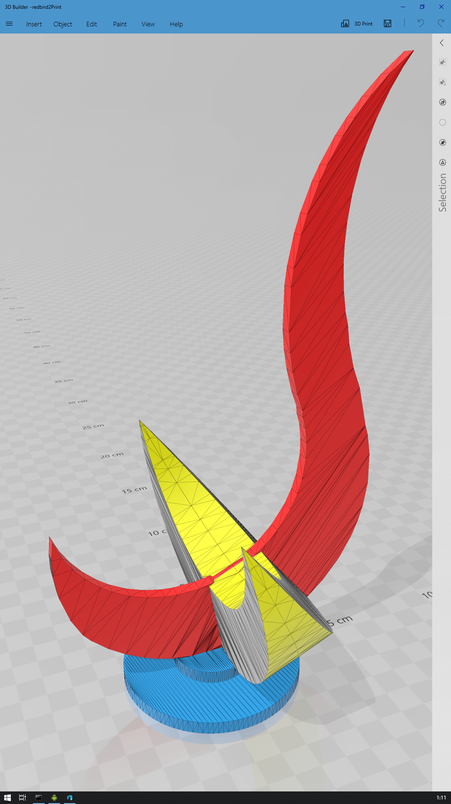

# RedBird3D

3D model for HKUST Redbird (Sundial)

## Usage

Download the "redbird2Print.stl" or "redbird2PrintX4.stl" and print it with a 3D printer.

## Modify

Follow the order of: "redbird.jpg" => "redbird.psd" => "redbird*.png" => "redbird*.3mf" => "redbird2Print*.stl" to create this 3D model from a photon tanken by my phone because I did not find any specific parameters about the Redbird.

## Preview

The colors are just to make parts distinguishable.

